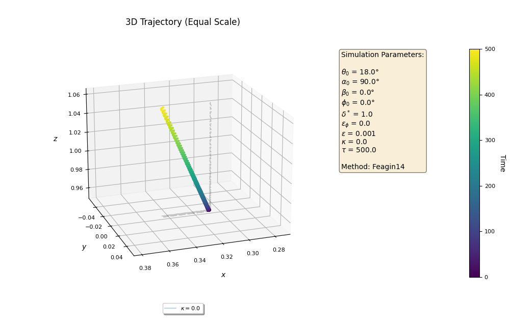
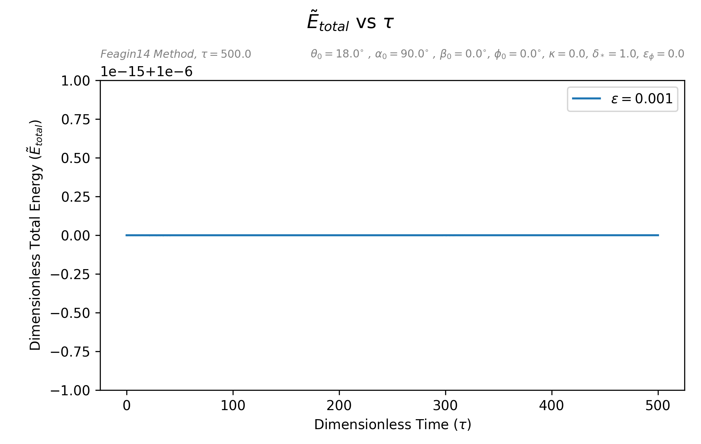

# Particle Dynamics in Electromagnetic Fields Simulation

This project involves simulating particle dynamics in electromagnetic fields using Julia for the core numerical computations and Python for visualization and data analysis. It tracks particle motion under specific initial conditions and visualizes the system's behavior over time using various plotting techniques.

## Table of Contents
1. [Project Overview](#project-overview)
2. [Installation](#installation)
    1. [Prerequisites](#prerequisites)
    2. [Package Installation](#package-installation)
3. [Running the Simulation](#running-the-simulation)
    1. [Initial Conditions](#initial-conditions)
    2. [Julia Simulation](#julia-simulation)
    3. [Python Visualization and Post-Processing](#python-visualization-and-post-processing)
4. [Plotting Options](#plotting-options)
    1. [2D Plotting (`plotter_2D.py`)](#2d-plotting-options-plotter_2dpy)
    2. [3D Plotting (`plotter_3D.py`)](#3d-plotting-options-plotter_3dpy)
    3. [Energy and Momentum Conservation Plotter](#energy-and-momentum-conservation)
    4. [Electric Field Plotter (`plotter_electricField.py`)](#electric-field-plotter-plotter_electricfieldpy)
    5. [Magnetic Field Plotter (`plotter_magneticField.py`)](#magnetic-field-plotter-plotter_magneticfieldpy)
    6. [Violation Plotter (`plotter_violation.py`)](#violation-plotter-plotter_violationpy)
    7. [Velocity Components Plotter (`plotter_velocity_components.py`)](#velocity-components-plotter-plotter_velocity_componentspy)
5. [Peak Finder and Adiabatic Invariant Measurement (`peakfinder.py`)](#peak-finder-and-adiabatic-invariant-measurement-peakfinderpy)
6. [Configuration](#configuration)
7. [Physics and Equations of Motion](#physics-and-equations-of-motion)
8. [Contributors](#contributors)

---

## Project Overview

This project simulates the behavior of particles in electromagnetic fields. The simulation integrates particle equations of motion and visualizes the results using various plotting techniques. The features include:

- **Particle trajectory computation** in an electromagnetic field.
- **Energy and momentum conservation** visualizations.
- **2D and 3D plot generation**.
- **Electric and magnetic field visualizations**.
- **Velocity component analysis**.
- **Peak detection** in particle motion data.

---

## Installation

### Prerequisites

You will need the following installed on your system:

- **Python**: [Install Python](https://www.python.org/downloads/).
- **Pip**: [Install Pip](https://pip.pypa.io/en/stable/installation/).
- **Julia**: [Install Julia](https://julialang.org/downloads/).

### Package Installation

Once the prerequisites are installed, use the following commands to set up the environment:

```bash
julia install_packages.jl
python3 -m pip install -r requirements.txt
```

Ensure that Julia is installed and used for the core numerical simulations, while Python handles the post-processing and visualization.

---

## Running the Simulation

### Initial Conditions

Modify the system's initial conditions in the `initial_conditions.txt` file. Default conditions are as follows:

```
theta_0 = π/10
alpha_0 = π/2 
beta_0 = 0
phi_0 = π/2
epsilon = 0.0005
eps_phi = 0.0
kappa = 0.0
delta_star = 1.0
number_of_trajectories = 10000
time_end = 50000.0
```

### Julia Simulation

1. Open a terminal and navigate to the directory where `Start.jl` and associated files are located.
2. Run the simulation using:
   ```bash
   julia Start.jl
   ```
3. Choose the type of simulation (3D or 2D) when prompted.
4. Modify initial conditions as necessary in the `initial_conditions.txt` file.

### Python Visualization and Post-Processing

Once the simulation is complete, use the following Python scripts to visualize the data:

- **2D Plotting**:
    ```bash
    python plotter_2D.py
    ```

- **3D Plotting**:
    ```bash
    python plotter_3D.py
    ```

- **Energy and Momentum Visualization**:
    ```bash
    python plotter_conservation.py
    ```

- **Electric Field Visualization**:
    ```bash
    python plotter_electricField.py
    ```

- **Magnetic Field Visualization**:
    ```bash
    python plotter_magneticField.py
    ```

- **Violation Analysis**:
    ```bash
    python plotter_violation.py
    ```

- **Velocity Components Analysis**:
    ```bash
    python plotter_velocity_components.py
    ```

- **Peak Detection**:
    ```bash
    python peakfinder.py
    ```

## Plotting Options

### 2D Plotting Options (`plotter_2D.py`)

This script generates 2D plots from CSV data produced by the simulation.

#### Features:
- **Single-file and Multi-file Support**: Plot data from one or more CSV files.
- **Dynamic Titles and Legends**: Automatically generate LaTeX symbols for parameters.
- **Sorted Legends**: Sort the legend by a specific parameter (e.g., `eps`).
- **Interactive File Selection**: Select files from the current directory or a folder.
- **Custom Axis Labels**: Label axes with physical quantities (e.g., `rho`, `omega_rho`).

#### Usage:

1. **Single File Mode**:
   ```bash
   python plotter_2D.py
   ```
   - Select the x-axis and y-axis from available options.

2. **Multi-file Mode**:
   ```bash
   python plotter_2D.py
   ```
   - Select multiple files and the script will group them by shared parameters (e.g., `eps`).

#### Example Output:
Example output generated by `plotter_2D.py` in multi-file mode with legend sorted by `eps`:


---

### 3D Plotting Options (`plotter_3D.py`)

This script visualizes particle trajectories in 3D space using the data from the CSV files.

#### Features:
- **3D Trajectory Plotting**: Interactive 3D plots with rotation and zooming.
- **Guiding Center Approximation**: Option to enable guiding center approximation.
- **Custom Color Themes**: Customize the plot appearance with different themes.
- **Subsampling**: Reduces the size of large datasets for clearer visualizations.

#### Usage:

```bash
python plotter_3D.py
```

- Select the files to plot and adjust the plot's visual settings.

#### Example Output:
Example output generated by `plotter_3D.py` showing the particle's 3D trajectory:



---

### Energy and Momentum Conservation

This script visualizes the conservation of energy and momentum during the simulation.

#### Features:
- **Energy Plot**: Displays the total energy over time.
- **Momentum Plot**: Shows momentum in different directions.

#### Usage:

```bash
python plotter_conservation.py
```

#### Example Output:
Example output visualizing energy conservation:



---

### Electric Field Plotter (`plotter_electricField.py`)

This script generates various plots for electric field distributions.

#### Features:
- 2D streamplot of electric field
- 3D quiver plot of electric field vectors
- 2D and 3D contour plots of electric field magnitude
- Customizable plot parameters and output options

#### Usage:
```bash
python plotter_electricField.py
```

---

### Magnetic Field Plotter (`plotter_magneticField.py`)

Creates plots for magnetic field distributions and vector fields.

#### Features:
- 2D streamplot of magnetic field lines
- 3D quiver plot of magnetic field vectors
- 2D and 3D contour plots of magnetic field strength
- 2D quiver plot of magnetic field vectors
- Customizable plot parameters and output options

#### Usage:
```bash
python plotter_magneticField.py
```

---

### Violation Plotter (`plotter_violation.py`)

Analyzes and plots the relative change ratio of magnetic moment.

#### Features:
- Calculates and plots Δ(μ)/μ against time
- Includes moving average calculation
- Identifies violation points where Δ(μ)/μ exceeds a threshold
- Interactive plot with customizable parameters

#### Usage:
```bash
python plotter_violation.py
```

---

### Velocity Components Plotter (`plotter_velocity_components.py`)

Plots parallel and perpendicular velocity components against time.

#### Features:
- Plots v_parallel and v_perpendicular against time
- Customizable plot styling and labels
- Option to add subtitle for additional information

#### Usage:
```bash
python plotter_velocity_components.py
```

---

## Peak Finder and Adiabatic Invariant Measurement (`peakfinder.py`)

The `peakfinder.py` script detects peaks in the simulation data, computes extrema, and visualizes them along with the particle motion.

### Features:
- **Peak Detection**: Detects local maxima or minima in the particle motion data using algorithms like `find_peaks` from `scipy` and `findpeaks`.
- **Single and Multi-file Modes**: Detect peaks for both single and multiple CSV files.
- **Extremum Analysis**: Analyze extrema for variables such as `rho`, `z`, etc.
- **Adiabatic Invariant Calculation**: Calculates and plots adiabatic invariants.

### Adiabatic Invariant Formula:

- **Magnetic Moment (`μ`) Method**:

   

   Where:
   -  is the perpendicular momentum.
   -  is the magnetic field strength.

- **Path Integral Method**: There is another method available that is going to calculate adiabatic invariant quantity. This is based on the path integral of velocity in R direction on each cycle of gyration.

### Configuration:
The script reads configurations from `config.yaml`. Important configuration options include:

- `save_file_name`: Name for the saved output.
- `extremum_of`: Variable on which extrema will be detected (e.g., `rho`, `z`).
- `plots_folder`: Directory where the plots will be saved.

### Usage:

1. **Single File Mode**:
   ```bash
   python peakfinder.py
   ```
   - Select the variable to analyze (e.g., `rho`, `z`).
   - The script will detect and plot the extrema.

2. **Multi-file Mode**:
   ```bash
   python peakfinder.py
   ```
   - Select multiple files for batch processing.
   - The script will process each file and plot the detected peaks.

#### Example Output:
Example output showing detected peaks in `rho`:


---

## Physics and Equations of Motion

### 2D Simulation:

The 2D simulation models particle motion in **cylindrical coordinates** (`ρ`, `z`, `φ`). The key equations solved include:

- **Equation of Motion for `ρ` and `z`**:

```math
\frac{d^2 \rho}{dt^2}, \frac{d^2 z}{dt^2}
```

   These describe the particle's motion in radial and vertical directions under the influence of the electromagnetic fields.

### 3D Simulation:

The 3D simulation solves for **radial distance** (`ρ`), **vertical position** (`z`), and **azimuthal angle** (`φ`). The key equations of motion involve:


```math 
\frac{d{\widetilde{R}}^2}{{d\tau}^2}=\frac{ \widetilde{R}.\widetilde{z}}{{(\widetilde{R}^2+\widetilde{z}^2)}^{3/2}} \frac{d\phi}{d\tau}+ \widetilde{R} ({\frac{d\phi}{d\tau}})^2-\epsilon_\phi\frac{\partial \widetilde{\Phi}}{\partial \widetilde{R}}
```
```math 
\frac{d{\widetilde{\phi}}^2}{{d\tau}^2}=\space(\frac{1}{{(\widetilde{R}^2+\widetilde{z}^2)}^{3/2}} (\widetilde{R}\frac{d\widetilde{z}}{d\tau}-\widetilde{z}\frac{d\widetilde{R}}{d\tau})- 2\frac{d\widetilde{R}}{d\tau}\frac{d\phi}{d\tau})/\widetilde{R}
```
```math 
\frac{d{\widetilde{z}}^2}{{d\tau}^2}=- \frac{\widetilde{R}^2}{{(\widetilde{R}^2+\widetilde{z}^2)}^{3/2}} \frac{d\phi}{d\tau}-\epsilon_\phi\frac{\partial \widetilde{\Phi}}{\partial \widetilde{z}}
```

This simulates the full trajectory in a 3D cylindrical coordinate system under magnetic and electric fields.
The guiding center approximation can also be employed for specific scenarios.

- **Magnetic Flux Function**:

   ```math 
    \Phi = \kappa  \Phi _0 \left(1-\delta_*^2 \left(1-\frac{z^2}{R^2+z^2}\right)\right) \ln \left(\frac{1}{R^2+z^2}\right)+\frac{1}{2} \phi _0 \left(1-\frac{z^2}{R^2+z^2}\right)
  ```

- **Expanded Derivatives**:

   Radial derivative:
   
    ```math
  \frac{\partial \Phi}{\partial R}=\frac{R \Phi _0 \left(-2 \kappa  R^2+2 \delta_*^2 \kappa  \left(R^2-z^2 \log
   \left(\frac{1}{R^2+z^2}\right)\right)+(1-2 \kappa )
   z^2\right)}{\left(R^2+z^2\right)^2}
    ```   

   Vertical derivative:
   
    ```math
  \frac{\partial \Phi}{\partial z}=-\frac{z \Phi _0 \left((2 \kappa +1) R^2-2 \delta_*^2 \kappa  R^2 \left(\log
   \left(\frac{1}{R^2+z^2}\right)+1\right)+2 \kappa 
   z^2\right)}{\left(R^2+z^2\right)^2}
    ```   
These equations describe the magnetic flux function and its derivatives in the radial and vertical directions, which are crucial for understanding the magnetic field structure in the simulation.

---

## Contributors

[List of contributors or link to contributors file]
